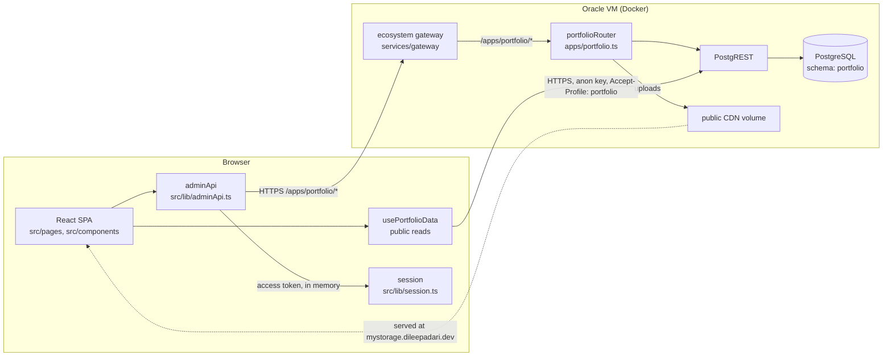
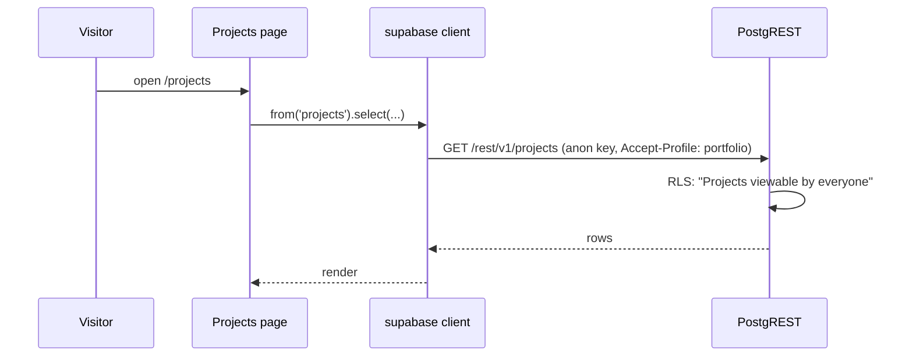
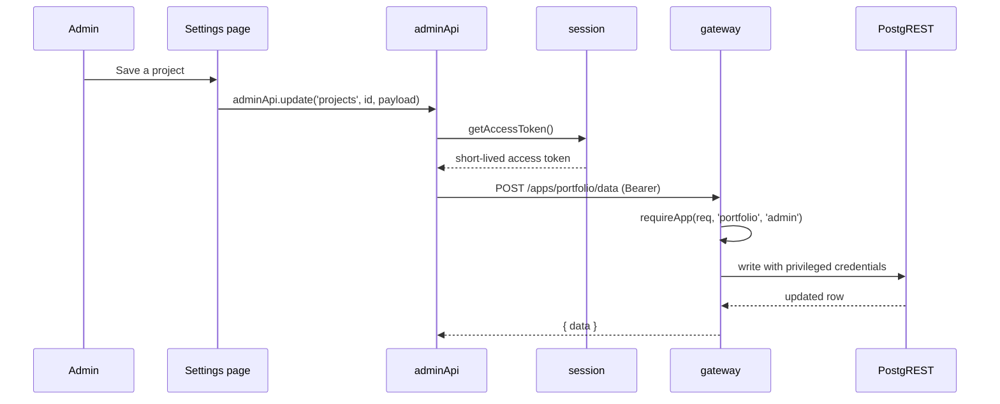

# Portfolio - Developer Documentation

Dileep Adari's personal site: profile, project showcase, blog and contact, all of it editable from
the browser by the one account that holds the grant.

This document is the technical reference. For what the site is and what it looks like, see
[README.md](./README.md).

## Table of contents

- [Tech stack](#tech-stack)
- [Architecture overview](#architecture-overview)
- [Where this app sits in the ecosystem](#where-this-app-sits-in-the-ecosystem)
- [Data model](#data-model)
- [The project showcase](#the-project-showcase)
- [The dark and light pairing rule](#the-dark-and-light-pairing-rule)
- [Auth model](#auth-model)
- [Anonymous engagement](#anonymous-engagement)
- [API surface](#api-surface)
- [Frontend structure](#frontend-structure)
- [Routing](#routing)
- [Theming](#theming)
- [Markdown rendering and sanitising](#markdown-rendering-and-sanitising)
- [Environment variables](#environment-variables)
- [Local development](#local-development)
- [Testing](#testing)
- [Continuous integration](#continuous-integration)
- [Deployment](#deployment)
- [Performance](#performance)
- [Security notes](#security-notes)
- [Known constraints and future work](#known-constraints-and-future-work)
- [Glossary](#glossary)

## Tech stack

| Layer | Choice | Version |
|---|---|---|
| UI | React | 19 |
| Language | TypeScript | 5.9 |
| Build | Vite | 7 |
| Styling | Tailwind CSS | 4 |
| Components | shadcn/ui on Radix primitives | - |
| Routing | react-router-dom | 7 |
| Server cache | TanStack Query | 5 |
| Data client | @supabase/supabase-js (PostgREST only) | 2 |
| Markdown | react-markdown, remark-gfm, rehype-raw, rehype-sanitize, rehype-highlight | - |
| Tests | Vitest + Testing Library + jsdom | 5 |
| Session | `@completeos/auth-client` (workspace package) | - |
| Shared UI | `@completeos/ui` (workspace package) | - |

Versions are read from `package.json`; check there rather than trusting this table after a bump.

## Architecture overview



What each box owns:

- **React SPA** owns presentation. It renders what it is given and computes nothing that another
  screen could disagree about.
- **usePortfolioData** owns every public read. Those go straight to PostgREST with the anon key,
  under row level security, so the site is fast and needs no session to be readable.
- **adminApi** owns every write. Nothing else in the frontend calls `fetch` against the gateway.
- **session** owns identity. The access token lives in memory only; the refresh token is an
  HttpOnly cookie on `.dileepadari.dev` that JavaScript cannot read.
- **portfolioRouter** owns the two operations the generic gateway route cannot express: the
  key/value `site_settings` upsert, and file upload to the CDN volume.
- **PostgreSQL** owns constraints and the row level security policies that make anonymous reads
  safe in the first place.

### The read path

Public reads do not go through the gateway at all.



### The write path



The browser never holds a credential that can write. That is the whole point of the split: the anon
key it does hold reaches only what row level security already publishes.

## Where this app sits in the ecosystem

This app is `apps/portfolio` in the **CompleteOS** monorepo, alongside `workos`, `moneyos` and
`lifebook`. It shares four workspace packages:

| Package | What it gives this app |
|---|---|
| `@completeos/auth-client` | `createSessionClient`, the single sign-on session |
| `@completeos/ui` | `AppSwitcher`, `Assistant`, `AiKeySettings` |
| `@completeos/tokens` | the design tokens and the WCAG contrast gate |
| `@completeos/registry` | the shared entity registry the gateway validates against |

Signing in on any ecosystem app signs you in here too, because the refresh cookie is set on the
parent domain. The apps share one Postgres for cost, not because they are entangled: each keeps its
own schema, and CI has a `check-separability.sh` gate that fails if one app's schema references
another's.

## Data model

Sixteen tables in the `portfolio` schema. They fall into four groups.

| Group | Tables |
|---|---|
| Profile content | `personal_info`, `experience`, `education`, `skills`, `achievements`, `courses`, `languages` |
| Showcase | `projects` |
| Blog | `blog_posts`, `blog_comments`, `blog_likes` |
| Operational | `site_settings`, `contact_messages`, `task_requests`, `admin_users`, `profiles` |

Row level security is the public contract:

| Table | Anonymous can |
|---|---|
| `projects`, `personal_info`, `experience`, `education`, `skills`, `achievements`, `courses`, `languages`, `site_settings` | select, unconditionally |
| `blog_posts` | select where `published = true` |
| `blog_comments` | select where `is_approved = true`; delete its own by `x-visitor-id` |
| `blog_likes` | select; insert; delete its own by `x-visitor-id` |
| `contact_messages`, `task_requests` | insert only; never select |

Everything else is denied to the anon key and reachable only through the gateway.

## The project showcase

`projects` is the widest table because a project row is both a card and a full page. Beyond the card
fields (`title`, `description`, `tags`, `language`, `stars`, `forks`, `featured`, `order_index`), a
row carries the showcase page:

| Column | Holds |
|---|---|
| `slug` | the URL segment for `/projects/:slug` |
| `tagline`, `overview`, `problem` | the prose at the top of the page |
| `features`, `tech_stack`, `architecture`, `metrics`, `timeline` | structured sections |
| `getting_started`, `readme` | long-form markdown |
| `project_role`, `status`, `is_contributed` | provenance |
| `hero_url`, `image_url`, `images` | dark-theme imagery |
| `hero_url_light`, `image_url_light`, `images_light` | the light-theme counterparts |
| `github_url`, `live_url`, `demo_url`, `docs_url` | outbound links |

**A section with no content is omitted, not rendered empty.** A half-filled project should read as a
shorter page, not a broken one.

### The dark and light pairing rule

Every image field has a `_light` counterpart. `src/lib/themedSource.ts` picks between them, and it
reads `resolvedTheme`, never `theme`: `theme` can be the literal string `"system"`, which matches
neither. When a light variant is absent the dark one is used for both, which is why a project with
one screenshot still renders.

## Auth model

There is **no public sign-up**. One person administers this site.

- Sign-in posts to the gateway through `session.login(identifier, password)`.
- The gateway returns a short-lived access token, held **in memory only**, and sets a refresh token
  as an HttpOnly cookie on `.dileepadari.dev`.
- `useAuth` maps the session user to `{ id, username, isAdmin }`. `isAdmin` is true only when the
  user's `apps.portfolio` grant is `admin` or `owner`; a valid ecosystem session with no portfolio
  grant is signed in but is not an administrator, and `signIn` logs it straight back out with a
  message saying so.
- Nothing is written to `localStorage` or `sessionStorage`. The helper that used to do that
  (`src/lib/adminAuthToken.ts`) was removed when the shared session replaced it.

## Anonymous engagement

Blog likes and comments need ownership without accounts. A random uuid in `localStorage`
(`portfolio_visitor_id`) is sent as the `x-visitor-id` header, and the RLS delete policies compare
against it.

That header is set by the client, so it is only ever as private as the id itself. **Nothing may
publish one browser's visitor id to another**, which is why:

- the public comment read names its columns instead of using `select('*')`, omitting both
  `visitor_id` and the `author_email` commenters type into the form;
- the like state is two server-side counts (all likes, then likes matching this visitor) rather than
  a list of everyone's ids;
- the delete affordance is drawn from `ownsComment(id)`, which reads this browser's own record of
  what it posted, in `src/lib/visitor.ts`.

## API surface

Everything the browser writes goes to `${VITE_GATEWAY_URL}/apps/portfolio`.

| Route | Method | Purpose |
|---|---|---|
| `/data` | POST | generic row operations, entity `portfolio.<table>`, `operation` one of select, insert, update, upsert, delete |
| `/settings` | PUT | upsert one `site_settings` key, which is text-keyed and does not fit `/data` |
| `/upload` | POST | put an image or document on the public CDN and return its URL |

All three require a portfolio admin grant, checked by the gateway's `requireApp`.

## Frontend structure

```
src/
  pages/          one file per route
  components/     app components; components/ui is vendored shadcn/ui
  hooks/          usePortfolioData (public reads), useManagement (admin lists),
                  useAuth, useAdmin, useDocumentMeta, useHighlightTheme
  lib/            adminApi (all writes), session, visitor, themedSource,
                  utils (incl. sanitizeHtml), colorPalettes, projectCategories
  providers/      ThemeProvider
  integrations/   the generated PostgREST types and the client
  layouts/        Layout, the shared chrome
```

`src/components/ui/` is vendored third-party code. It is excluded from the doc-comment rule; every
other own source file carries a module docblock, per [docs/COMMENT_STYLE.md](./docs/COMMENT_STYLE.md).

## Routing

| Path | Page | Notes |
|---|---|---|
| `/` | `Profile` | eager, it is the landing page |
| `/projects` | `Projects` | lazy |
| `/projects/:slug` | `ProjectDetail` | lazy, the showcase page |
| `/blog` | `Blog` | lazy |
| `/blog/:slug` | `BlogPostView` | lazy |
| `/contact` | `Contact` | lazy |
| `/auth` | `Auth` | lazy, admin sign-in |
| `/settings` | `Settings` | lazy, admin only |
| `*` | `NotFound` | lazy |

Every route except `/` is code-split, which is what keeps the entry bundle inside the CI tripwire.

## Theming

Light, dark and system, cycled by the toggle in the header. The choice is stored under
`vite-ui-theme` in `localStorage`, and `ThemeProvider` exposes both `theme` (what was chosen,
possibly `"system"`) and `resolvedTheme` (what is actually on screen).

**Anything picking an asset per theme must read `resolvedTheme`.** Comparing `theme` against
`"dark"`/`"light"` silently fails for every visitor on the default.

## Markdown rendering and sanitising

`src/components/Markdown.tsx` is the single renderer, used by blog posts and project READMEs.

Plugin order is load bearing:

```
rehypeRaw -> [rehypeSanitize, HTML_SCHEMA] -> [rehypeHighlight, { subset }]
```

Raw HTML has to be parsed before it can be filtered, and highlighting has to run after the filter or
the sanitiser strips the `hljs-*` classes it just added.

Two details that were each a bug once:

- **The subset is not optional.** `rehype-highlight` auto-detects across roughly 190 grammars for
  every untagged code block. A README with a handful of them locked the renderer hard enough to time
  out a screenshot capture.
- **`readme` is not first-party content.** It holds text copied out of other people's repositories,
  so the allow-list is GitHub's own schema plus only what a README header needs.

Short inline strings (titles, excerpts, footer text) go through `sanitizeHtml` in `src/lib/utils.ts`
instead, which allows a small set of formatting tags. It unwraps an element it does not allow but
keeps the text, and it sanitises that element's subtree *before* hoisting it, which is the fix for a
bypass where `<section></section>` came through intact.

## Environment variables

Only `VITE_*` reaches the browser, and everything under that prefix is public by definition.

| Variable | Required | Purpose |
|---|---|---|
| `VITE_SUPABASE_URL` | yes | PostgREST origin for public reads |
| `VITE_SUPABASE_PUBLISHABLE_KEY` | yes | the anon key; ships in the bundle by design |
| `VITE_SUPABASE_PROJECT_ID` | yes | project reference |
| `VITE_GATEWAY_URL` | no | defaults to `https://api.dileepadari.dev` |

The gateway's own secrets live on the box, never here. See `.env.example`.

**Do not create `.env.local`.** Vite gives it precedence over `.env`, which is how a local run once
silently pointed at a different database. Pass values inline instead:

```sh
VITE_SUPABASE_URL=... VITE_SUPABASE_PUBLISHABLE_KEY=... npm run dev
```

## Local development

```sh
git clone git@github.com:Dileepadari/CompleteOS.git
cd CompleteOS
npm ci                      # installs the workspace, including the shared packages
cd apps/portfolio
npm run dev                 # with the VITE_* values set inline, as above
```

`npm ci` must be run from the repository root. The app depends on workspace packages that do not
exist on the public npm registry, so installing from inside `apps/portfolio` alone will fail.

## Testing

```sh
npm test          # vitest run, 72 tests across 9 files, jsdom, no network
npm run lint
npm run typecheck
```

`npm run typecheck`, not `npx tsc --noEmit`: the root `tsconfig.json` is a solution file
(`"files": []` plus references), so pointing tsc at it compiles zero files and exits 0.

What the suites pin:

| File | Guards |
|---|---|
| `src/lib/utils.test.ts` | the inline sanitiser, including the unwrap bypass |
| `src/lib/visitor.test.ts` | that comment ownership is answered locally, not from server ids |
| `src/lib/adminApi.test.ts` | filename normalisation before it becomes a header and a path |
| `src/components/Markdown.test.tsx` | the sanitise/highlight plugin order and the allow-list |
| `src/components/ProjectGallery.test.tsx` | gallery behaviour with missing light variants |
| `src/components/ThemedImage.test.tsx` | that assets follow `resolvedTheme` |
| `src/hooks/useDocumentMeta.test.tsx` | per-page titles and meta |
| `src/pages/ProjectDetail.test.tsx` | that empty showcase sections are omitted |

## Continuous integration

`.github/workflows/ci.yml` at the repository root, on push to `main`, on pull request, and on
`workflow_dispatch`. There is deliberately **no scheduled run**.

| Job | Checks |
|---|---|
| `packages` | the four shared packages: tests, typecheck, WCAG contrast gate |
| `gateway` | `deno check` over every gateway module, and a guard against checking nothing |
| `registry` | replays migrations into a throwaway Postgres, and app separability |
| `portfolio` | this app: lint, typecheck, test, build, entry-bundle tripwire |
| `audit` | fails on high or critical runtime advisories |
| `secrets` | fails if any `.env` file is tracked |

The `portfolio` job exists because of what its absence hid: nothing in CI had ever compiled an app,
and this one was carrying 33 standing type errors while CI stayed green.

## Deployment

The frontend is a static build on Vercel: build command `npm run build`, output `dist`, with the
`VITE_*` variables set in the project's dashboard. `vercel.json` rewrites every extensionless path
to `index.html` so client-side routes survive a hard refresh.

The gateway and PostgREST run in Docker on the Oracle VM and are deployed independently of this
build.

## Performance

- Every route except the landing page is lazy-loaded; skeletons in `src/components/skeletons` hold
  the layout so the page does not jump.
- CI fails if the entry chunk passes 1.1 MB. It sits around 836 kB.
- The markdown chunk is large (about 515 kB) because of the highlighter, which is precisely why it
  is split out of the entry bundle.
- Images are `loading="lazy"` and `decoding="async"` throughout.

## Security notes

- The browser holds no credential that can write. The anon key reaches only what RLS publishes.
- The access token is memory-only; the refresh token is an HttpOnly cookie.
- Raw HTML in markdown is filtered by `rehype-sanitize` against an extended GitHub schema; inline
  strings go through `sanitizeHtml`.
- Uploads validate the client-supplied filename server side and cap the body size.
- All external links carry `rel="noreferrer noopener"`.
- **Sign-in has no rate limit.** It is recorded rather than solved; the gateway is the right place
  for it, and it is not built.
- `supabase/functions/admin` is retired and unreferenced. It is still in the tree; see
  [not_for_you.md](./not_for_you.md).

## Known constraints and future work

- The generated `src/integrations/supabase/types.ts` carries a hand-applied schema rename. Regenerate
  it with `--schema portfolio` or the rename is lost and every call site breaks instead of the file.
- `supabase/migrations` built the schema before it moved onto the shared box; they are history, not
  the way the current database is provisioned.
- Four featured projects have little or no showcase content written yet.
- The contact inbox has no notification; messages are read in the admin screen.

## Glossary

| Term | Meaning |
|---|---|
| **Gateway** | the ecosystem's single authenticated API, `api.dileepadari.dev` |
| **Grant** | a per-app role on an ecosystem user, e.g. `apps.portfolio = "admin"` |
| **Showcase page** | the full project page at `/projects/:slug`, as against the card |
| **Visitor id** | a per-browser uuid scoping anonymous likes and comments |
| **Anon key** | the PostgREST key that ships in the bundle; public by design |

---

Minor decisions, dead ends and the reasoning behind small choices are in
[not_for_you.md](./not_for_you.md).
