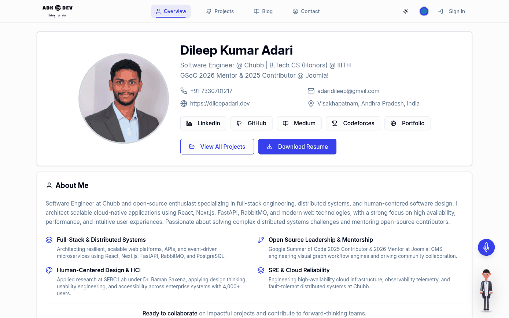
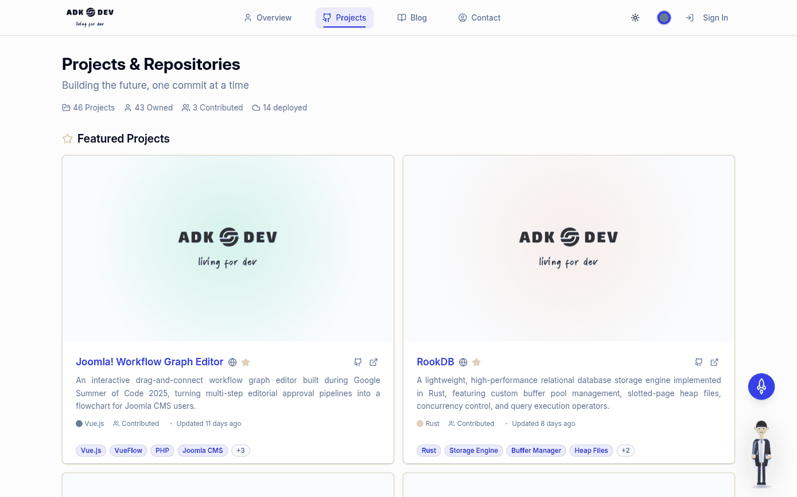
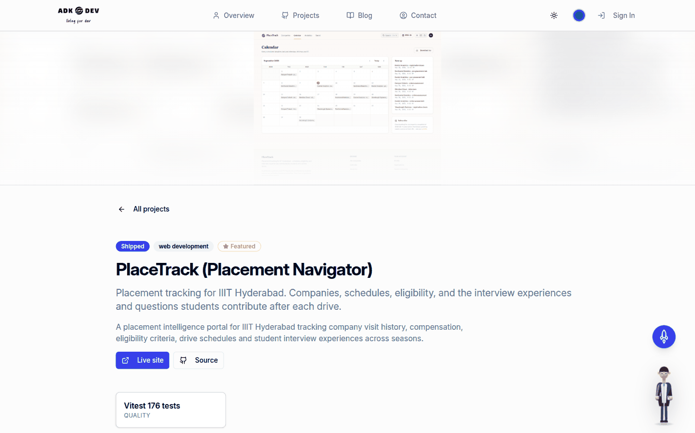
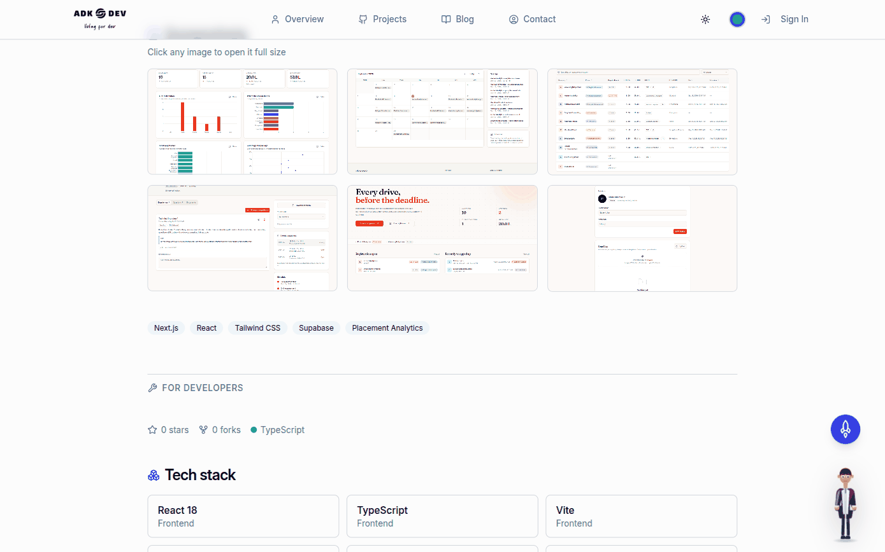
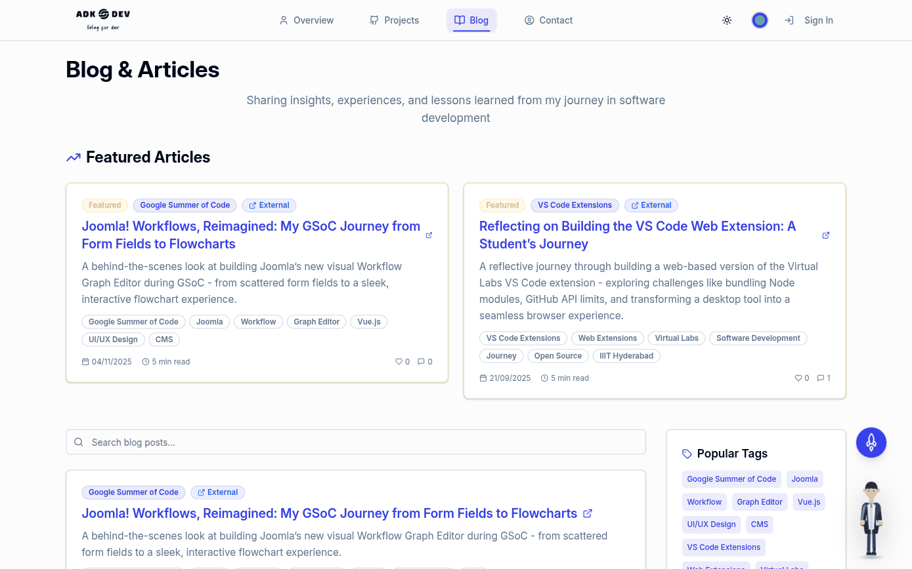
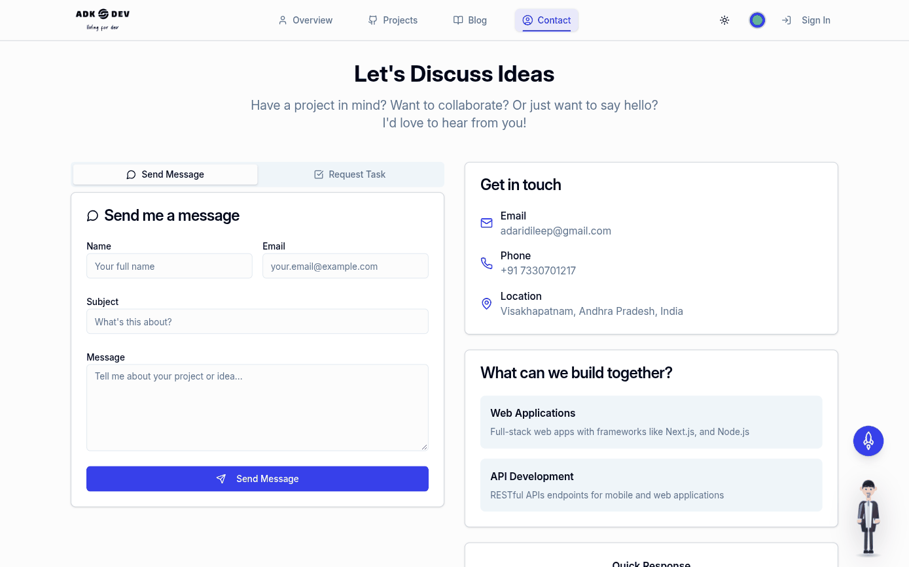
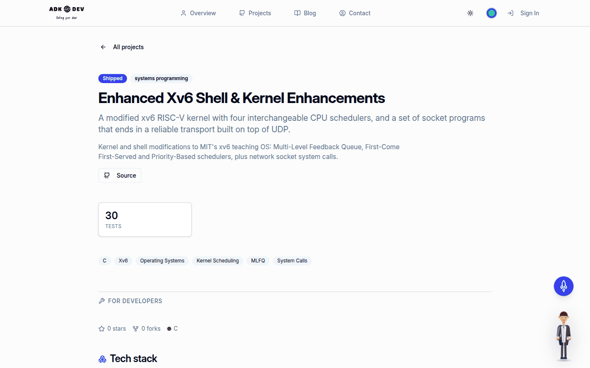
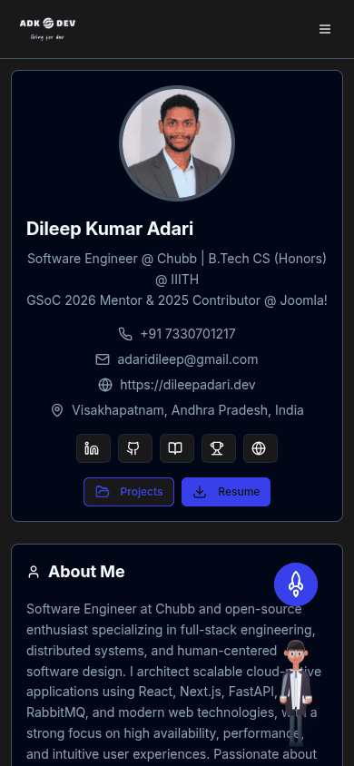
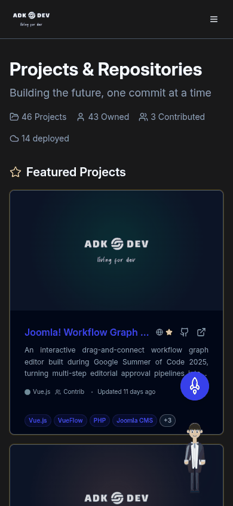
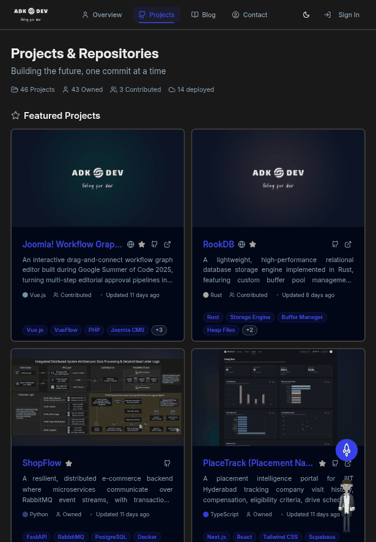

<!-- Generated from README.md by scripts/build-light-readme.mjs. Do not edit by hand. -->

<div align="center">

<picture>
  <source media="(prefers-color-scheme: dark)" srcset="./docs/assets/adk_dev_logo_light.png">
  
</picture>

# Portfolio

**Dileep Adari's personal site: profile, project showcase, blog and contact, every word of it editable from the browser by the one account that is allowed to.**


<br>


<br><br>

[](https://github.com/Dileepadari/CompleteOS/actions/workflows/ci.yml)

**Live:** [dileepadari.dev](https://dileepadari.dev) &middot; **[Developer documentation](./DEVDOC.md)** &middot; [Screenshots](#screenshots)

<p><b>Light mode</b> &middot; <a href="./README.md">View this page in dark mode</a></p>

</div>

---

## Contents

- [Why this project matters](#why-this-project-matters)
- [Screenshots](#screenshots)
- [Features](#features)
- [Architecture in one paragraph](#architecture-in-one-paragraph)
- [Getting started](#getting-started)
- [Contributing](#contributing)
- [License](#license)

---

## Why this project matters

A portfolio that needs a deploy to fix a typo stops being maintained. That is the whole design constraint.

Every piece of content here lives in Postgres and is edited in place from the site itself: the bio, the highlight cards, the experience and education entries, the skills, the projects, the blog, the resume PDF and the avatar. There is no CMS to log into and no markdown files to commit. Sign in as the one admin account, and the page you are looking at becomes the page you are editing.

The second constraint is that **a visitor pays for none of it**. The admin surface, the blog editor, the markdown renderer and the syntax highlighter are all code a reader never runs, so none of it is in the bundle they download. That is not free; it is the reason the routes are split the way they are, and the reason CI fails if the entry chunk grows past a limit.

## Screenshots

This page shows **light mode**; the same gallery in
dark mode is at **[README.md](./README.md)**.

| | |
|---|---|
| **Profile** <br> The landing page: bio, highlights, experience, skills, all of it editable in place <br><br>  | **Projects** <br> 46 projects; cards carry a dark and a light image and pick per theme <br><br>  |
| **Project showcase** <br> One project in full, addressed by slug <br><br>  | **Gallery and the developer half** <br> A lightbox gallery, then everything a developer needs behind a divider <br><br>  |
| **Blog** <br> Markdown posts with threaded comments and per-visitor likes <br><br>  | **Contact** <br> A message form and a task request form, both open to anyone <br><br>  |

<p align="center"><b>A partly filled project</b> &middot; sections with no content are omitted, not left as empty headings</p>
<p align="center"></p>

### Responsive

Captured at 390x844 (mobile) and 820x1180 (tablet).

| Mobile, profile | Mobile, projects | Tablet, projects |
|---|---|---|
|  |  |  |

## Features

| | |
|---|---|
| [Editable in place](#editable-in-place) | Every field, from the browser, by the admin account |
| [Project showcase pages](#project-showcase-pages) | A full page per project, reader half and developer half |
| [Theme-aware imagery](#theme-aware-imagery) | Every image is a dark/light pair, the light half optional |
| [Gallery with a lightbox](#gallery-with-a-lightbox) | Keyboard-navigable, mounted only when opened |
| [Uploads, not commits](#uploads-not-commits) | Resume, avatar and screenshots are uploaded, not bundled |
| [Blog with comments](#blog-with-comments) | Markdown posts, threaded comments, per-visitor likes |
| [Split bundles](#split-bundles) | The landing page does not carry the rest of the site |
| [Light and dark](#light-and-dark) | Both, remembered, defaulting to the OS |

---

### Editable in place

Sign in as the admin account and edit controls appear inline on whatever you are looking at. Writes go through the ecosystem gateway, which holds the privileged credentials and checks that your account carries a portfolio admin grant; the browser never has write access to the database. The access token it uses is held in memory only, and the refresh token is an HttpOnly cookie, so nothing reusable is left in web storage.

**Using it:** **Sign In**, then the pencil icons. Every table the gateway will accept is named explicitly in an allowlist, so a new table is a deliberate act rather than an accident.

### Project showcase pages

`/projects/:slug` is a full page per project, in two halves. The upper half is for someone deciding whether the project is interesting: tagline, headline numbers, overview, the problem it solves, the feature list, screenshots. The lower half, behind a divider labelled **For developers**, is for someone who has decided it is: repo stats, tech stack, architecture, getting started, and the project's README in full.

**Every section is conditional on its own content.** A project with just a title and a description renders a title and a description and stops. There is no placeholder copy anywhere on the page, which is why a half-filled project reads as a shorter page rather than a broken one.

**Using it:** click any project card. To fill one in, open it in the admin editor: the fields are grouped into the same two halves you see on the page.

### Theme-aware imagery

Card image, detail banner and every gallery entry are dark/light pairs. The light half is always optional: leave it blank and the dark one is used in both themes, which is the right answer for a photograph or a theme-neutral diagram.

The banner is contained rather than cropped, over a blurred copy of itself, so an uploaded image of any shape reads as a deliberate banner instead of an arbitrary zoomed slice.

**Using it:** every image field in the project editor has an optional "(light)" twin. Gallery lists are paired by position, and a shorter light list is fine.

### Gallery with a lightbox

Thumbnails are lazy; the full-size view is not mounted at all until something is opened. Arrow keys move, Escape closes, the backdrop closes, and the page behind cannot scroll while it is open.

### Uploads, not commits

The resume PDF and the profile avatar used to be `import`ed from `src/assets`, so replacing either meant a commit and a deploy. Both are columns now, with the bundled file as the fallback when the column is empty. Uploads go through the same admin gateway to a self-hosted CDN.

**Using it:** **Profile > edit**. The resume field takes a PDF; leave it empty to keep serving the bundled copy.

### Blog with comments

Markdown posts with GFM tables, raw HTML and syntax highlighting, threaded comments, and one like per visitor per post.

### Split bundles

Only the landing page is in the entry chunk. Every other route, and the ~500kB markdown and syntax-highlighting stack, load on demand, so a visitor who reads the profile and leaves downloads neither the blog editor nor the highlighter. CI fails the build if the entry chunk crosses 1.1MB.

### Light and dark

Both, with the choice remembered per browser and the default following the operating system.

## Architecture in one paragraph

A Vite React SPA on Vercel talks to exactly one backend endpoint: a Deno edge function that holds the service-role key, verifies a JWT it issued itself, and is the only thing in the system allowed to write. Public reads go straight to PostgREST under row-level security. Uploaded files go to a self-hosted CDN rather than Supabase Storage. [DEVDOC.md](./DEVDOC.md) has the detail.

## Getting started

Requires Node 20.19+ and, for the database, Docker.

```sh
git clone git@github.com:Dileepadari/portfolio.git
cd portfolio
npm install

npx supabase start        # applies every migration and the seed
cp .env.example .env.local
npm run dev               # http://localhost:8080
```

`npx supabase start` builds the whole schema from `supabase/migrations/` and loads `supabase/seed.sql`, which includes three projects chosen to exercise the showcase page: one filled in completely, one partly, and one with almost nothing.

```sh
npm test          # 42 tests
npm run lint
npx tsc --noEmit
npm run build
```

## Contributing

Branch off `main`, open a PR. CI runs four jobs and all must pass:

- **web** - lint, typecheck, tests, build, and the entry-bundle size check.
- **functions** - `deno check` over the admin edge function.
- **migrations** - starts a real Postgres and applies every migration from nothing. This job exists because that was impossible until recently; see [not_for_you.md](./not_for_you.md).
- **readme-pair** - `README-light.md` is generated, so it must match its source.

If you change `README.md`, regenerate its twin:

```sh
node scripts/build-light-readme.mjs
```

## License

MIT. See [LICENSE](./LICENSE).
